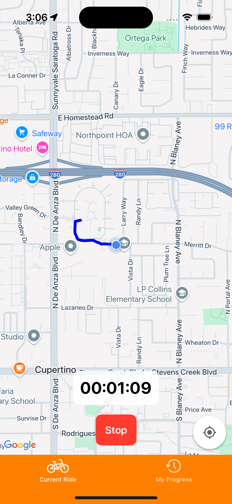
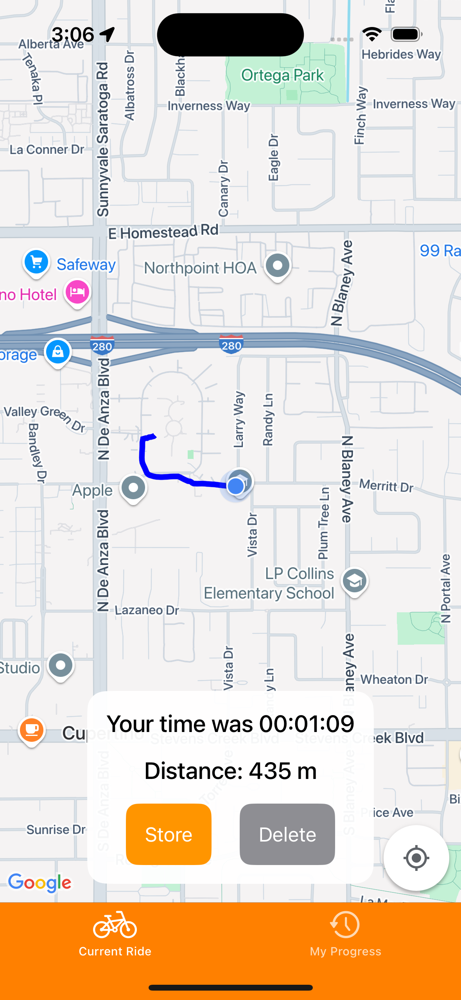
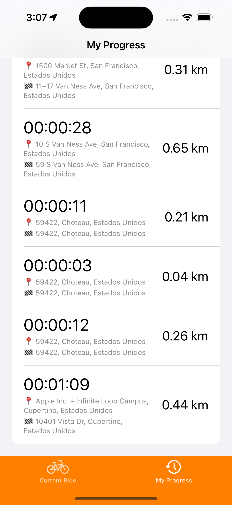

# 🚴‍♂️ RideTracker App

Una aplicación moderna desarrollada en SwiftUI para registrar y gestionar tus rutas de ciclismo. Ofrece seguimiento en tiempo real, almacenamiento de rutas pasadas y estadísticas detalladas, todo ello con una interfaz intuitiva y sin necesidad de registros ni anuncios.

---

## 🎯 Objetivo

Proporcionar una solución móvil sencilla y eficiente para que los ciclistas de todos los niveles puedan registrar sus recorridos, visualizar métricas en vivo y analizar su rendimiento, manteniendo siempre la privacidad del usuario al no requerir inicios de sesión ni recopilar datos personales.

---

## 💡 Principales Funciones

| Funcionalidad      | Descripción |
|--------------------|-------------|
| 📍 Seguimiento en Vivo | Rastreo de la ruta en tiempo real utilizando Core Location y GoogleMaps. |
| 🗺️ Visualización en Mapa | Muestra el recorrido actual y las rutas pasadas en mapas interactivos. |
| 📊 Métricas en Tiempo Real | Visualiza distancia, velocidad y altitud durante el recorrido. |
| 🕒 Historial de Rutas | Almacena y gestiona rutas anteriores con detalles y métricas asociadas. |

---

## 🖼️ Capturas de Pantalla

### On Boarding


### Seguimiento en Vivo


### Finalización de Ruta


### Guardar Ruta


### Historial de Rutas


---

## 🛠️ Tecnologías Utilizadas

- **SwiftUI**: Para la construcción de la interfaz de usuario declarativa y reactiva.
- **Core Location**: Para el seguimiento preciso de la ubicación en tiempo real.
- **Google Maps**: Para la integración de mapas interactivos que muestran las rutas.
- **Core Data**: Para el almacenamiento persistente de las rutas y preferencias del usuario.
- **Combine**: Para manejar eventos y datos de forma reactiva y eficiente.

---

## 📁 Estructura del Proyecto

```bash
RideTracker/
├── TektonApp.swift                     # Punto de entrada principal de la aplicación
├── Models/                             # Modelos de datos: Ride, Coordinate
│   ├── Ride.swift
│   └── OnBoardingPage.swift
├── Views/                              # Vistas construidas con SwiftUI
│   ├── CurrentRide
│   ├──── CurrentRideView.swift
│   ├──── CurrentRideViewModel.swift    # Lógica de presentación y manejo de datos
│   ├──── GoogleMapView.swift
│   ├──── RideSummaryView.swift
│   ├── Onboarding
│   ├──── OnBoardingPageView.swift
│   ├──── OnboardingView.swift 
│   ├── RidesList
│   ├──── RidesListView.swift
│   ├──── RidesListViewModel.swift    # Lógica de presentación y manejo de datos
│   ├── MainTabView
├── Services/                   # Servicios para manejo de ubicación y datos
│   ├── RideTrackingService.swift
├── Storage/                    # Manejo de persistencia con Core Data
│   ├── CoreDataStack.swift
│   └── RideStorage.swift
├── Resources/                  # Recursos como Assets y LaunchScreen
│   └── Assets.xcassets
└── README.md                   # 📄 Este archivo
```

## 🚀 Cómo Ejecutar

1. Clona el repositorio.
2. Abre el proyecto en Xcode.
3. Selecciona el esquema `Tekton` y corre en un simulador.

## 📌 Requisitos

- Xcode 15+
- iOS 17+
- Permiso de acceso a la ubicación para el seguimiento en tiempo real.


---

## 📬 Autor

Desarrollado por Carlos Muñoz para Tekton, siguiendo las mejores prácticas de desarrollo en SwiftUI y arquitectura limpia. ✨
